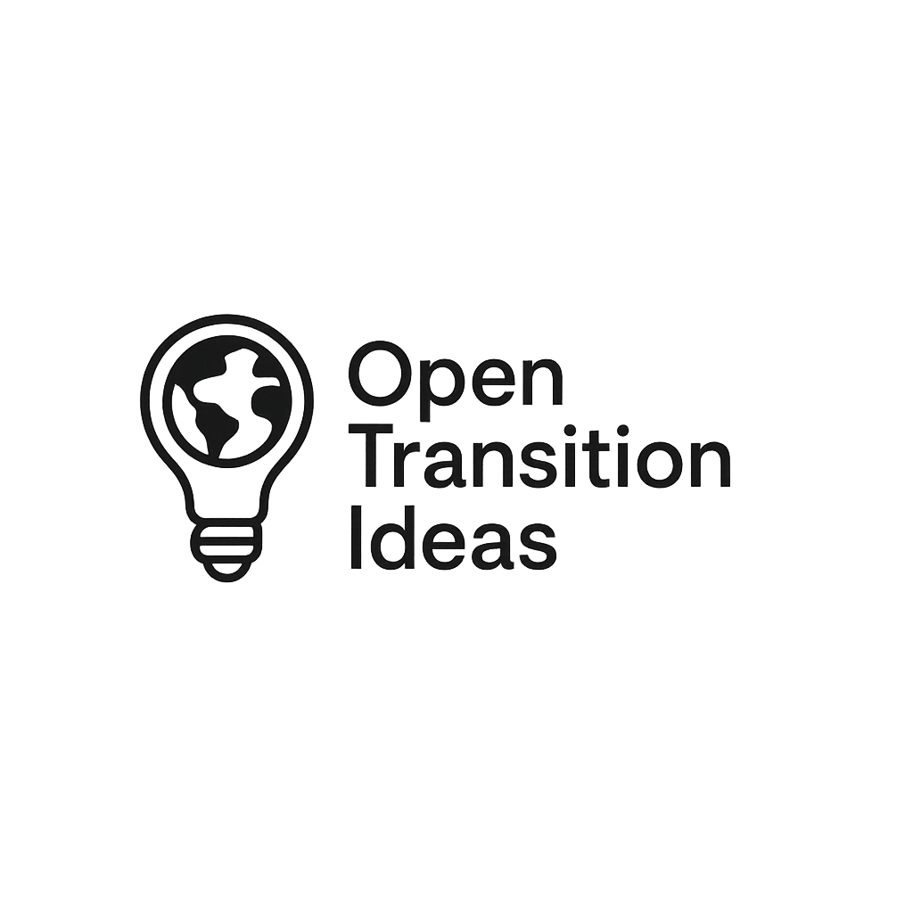

  

**A public initiative for open, documented ideas to accelerate the environmental, energy and climate transition**  
_Un projet public d’idées ouvertes et documentées pour accélérer la transition environnementale, énergétique et climatique_

---

## 🔹 What is this project?

**OpenTransitionIdeas** is an open and collaborative repository of technical, scientific or conceptual ideas to decarbonize, transform and regenerate human systems.

All ideas are:
- Free and open under [CC-BY 4.0 license](./LICENSE)
- Documented and reproducible
- Attributed to their authors
- Meant to be shared, improved, reused

🌱 The goal is not to patent, but to publish ideas as **public prior art** so that they remain accessible to all.

---

## 🔹 Qu’est-ce que ce projet ?

**OpenTransitionIdeas** est un dépôt collaboratif d’idées, de concepts techniques ou scientifiques, pour décarboner, transformer et régénérer nos systèmes.

Les idées publiées sont :
- Libres, ouvertes et sous [licence CC-BY 4.0](./LICENSE)
- Documentées et reproductibles
- Attribuées à leur auteur
- Destinées à être partagées, enrichies et réutilisées

🌍 L’objectif n’est pas de breveter, mais de créer une **antériorité publique** pour rendre ces solutions inaccessibles à la privatisation.

---

## 📘 Explore ideas / Explorer les idées

- 🔬 [Ideas Index](./ideas-index.md)
- 🧭 [Manifesto / Manifeste](./MANIFESTE.md)
- 🤝 [How to contribute](./CONTRIBUTING.md)

---

## ✍️ Author / Auteur

**Kevin GARRIGUES**  
Founder, curator, and open contributor

📍 France – 2025  
Contact: https://github.com/kevingarrigues

---

## 💬 Want to help?

You can:
- Submit your own idea
- Improve an existing one
- Translate, simplify, or test
- Just share the project

📩 See the [CONTRIBUTING.md](./CONTRIBUTING.md) file to get started.

---

## 🌐 Licence

All content in this repository is licensed under  
**Creative Commons Attribution 4.0 International (CC-BY 4.0)**  
Feel free to reuse, remix, and build upon — with credit.

